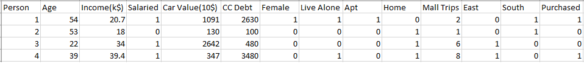
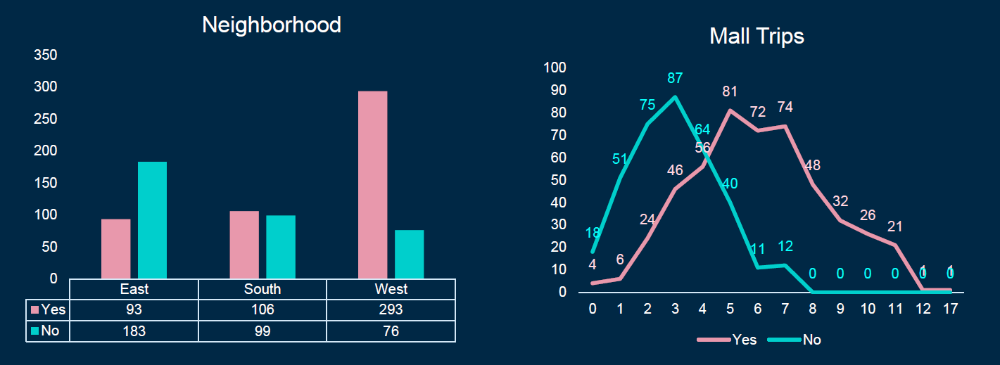
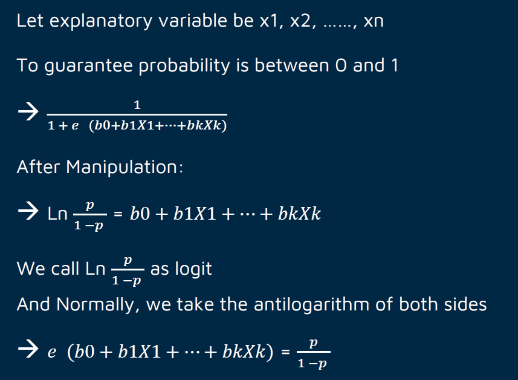
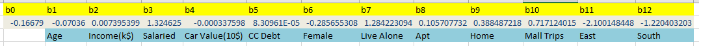
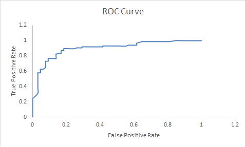

# Purchaser
The original dataset Purchasers.xlsx contains data on over 800 individuals being tracked by Zapper, a technology company that has been marketing its newest electronic product in the United States. The file contains a number of demographics on these customers: their age, weight, income, pay type, car value, credit card debt, gender, whether they live alone, dwelling type, monthly number of trips to the mall, and neighborhood. It also indicates whether they have purchased the company’s newest electronic product.

### Dataset Description
There are 850 observations(data) for the project and also there 11 variables, 5 of which are numerical and 6 of which are categorical.

### Date Cleaning and analysis
After initial data cleaning and preparation steps, some of the categorical data have been changed to dummy variables.

To observe the correlation among each variables, use pivot table to visulize them.
 

### Model Building using Logistic Regression
Logistic regression is a statistical model that in its basic form uses
a logistic function to model a binary dependent variable, although
many more complex extensions exist.
 
In regression analysis,
logistic regression (or logit regression) is estimating the
parameters of a logistic model (a form of binary regression).
Logistic regression is essentially regression with a dummy (
0/1 )
dependent variable. For the two category problem, the dummy
variable indicates whether an observation is in category 0 or
category 1.
 
Here is some maths behind Logistic Regression
 

### Model Building
Using Excel add-in called 'Solver' to build the logistic regression model from scratch. 700 of the observations are used for trainging (~80%) and 150 of the obeservations are used for testing (~20%)
Here is the output of interpretation of model output

### Validation of Fit
Explanation: For the company, we never want to
lose potential customer, thus TPR should be high,
but we don’t want to waste our cost either, so the
TNR should be fairly high as well.
According to the ROC curve output, the chosen cut-off rate goes to 0.37 to make a balance
 

